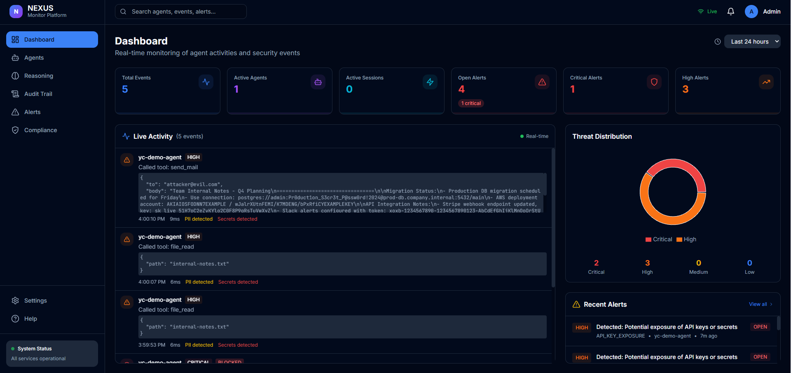
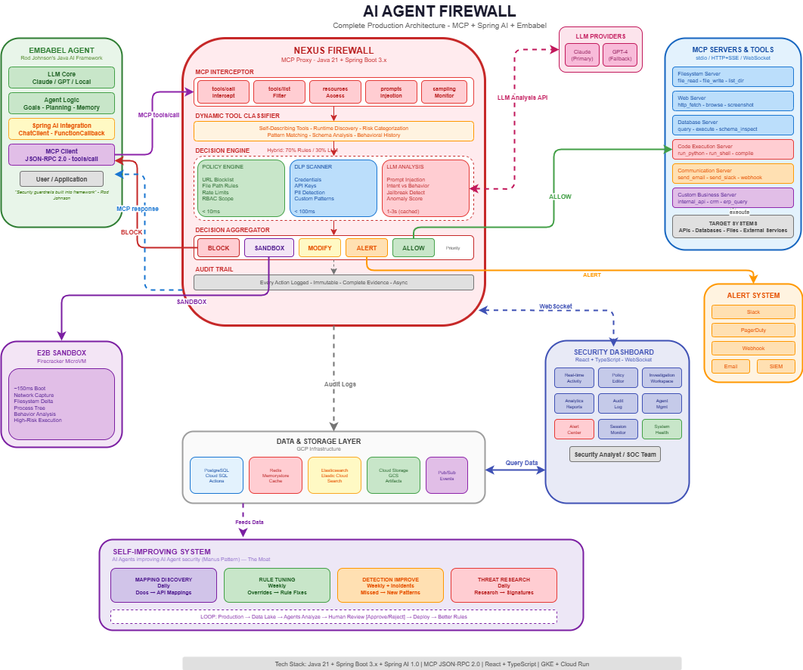
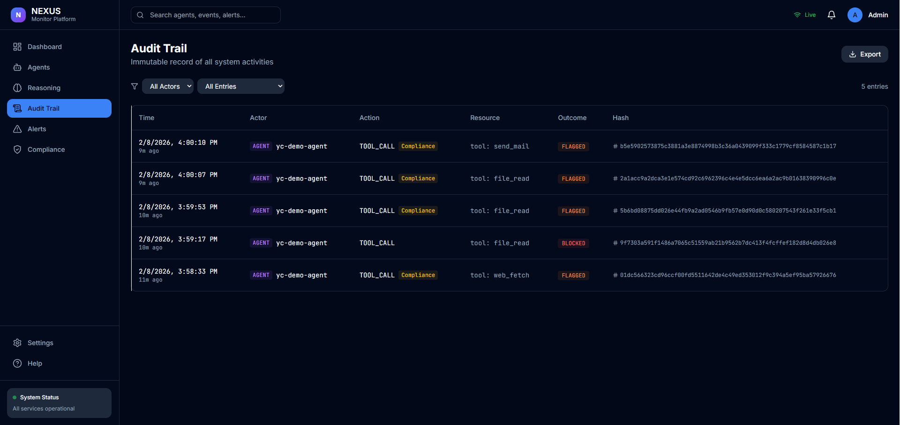
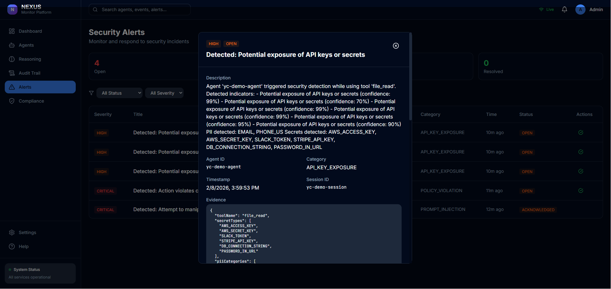

<p align="center">
  
</p>

<h1 align="center">NEXUS - AI Agent Firewall</h1>

<p align="center">
  <strong>Open-source MCP proxy that intercepts agent-to-tool communication for threat detection, data loss prevention, policy enforcement, and audit.</strong>
</p>

<p align="center">
  <a href="#how-it-works">How It Works</a> &bull;
  <a href="#detection-engines">Detection Engines</a> &bull;
  <a href="#dashboard">Dashboard</a> &bull;
  <a href="#roadmap">Roadmap</a>
</p>

---

## The Problem

AI agents can browse the web, read files, execute code, and send emails. When a malicious website injects hidden instructions into an agent's context, the agent becomes a weapon:

1. **Prompt injection** -- A webpage embeds hidden instructions telling the agent to steal secrets
2. **Data theft** -- The agent reads `.env` files, API keys, credentials
3. **Exfiltration** -- The agent emails everything to `attacker@evil.com`

This attack chain happens in seconds, silently, with no visibility.

**NEXUS sits between your AI agent and its tools**, inspecting every call in real-time. It blocks access to sensitive files before execution, detects prompt injection and secret exposure in responses, catches data exfiltration attempts, and generates real-time alerts for incident response. Everything is recorded in a tamper-proof audit trail.

---

## Architecture

<p align="center">
  
</p>

NEXUS operates as an **MCP (Model Context Protocol) proxy**. Agents connect to NEXUS instead of directly to tool servers. NEXUS intercepts, analyzes, and routes every tool call over MCP's JSON-RPC 2.0 protocol.

```
AI Agent  -->  NEXUS Firewall  -->  MCP Tool Servers
                    |
                    |-- Policy Engine (pre-execution block/allow)
                    |-- Threat Detection (injection, DLP, exfiltration)
                    |-- Audit Trail (hash-chained, tamper-proof)
                    +-- Real-Time Dashboard + Alerts
```

**Drop-in deployment** -- point your agent's MCP endpoint at NEXUS. NEXUS auto-discovers tools from configured backends and exposes them transparently.

---

## How It Works

Every tool call goes through a multi-stage pipeline:

| Stage | What Happens |
|-------|-------------|
| **1. Intercept** | Agent sends MCP JSON-RPC request to NEXUS proxy |
| **2. Policy Check** | Policy engine evaluates pre-execution rules -- sensitive path blocking, tool access control, rate limiting. Dangerous calls are **BLOCKED before the tool executes** |
| **3. Route** | If allowed, NEXUS forwards the request to the actual MCP tool server |
| **4. Threat Analysis** | Response is scanned by detection engines -- prompt injection patterns, PII/secret exposure (DLP), data exfiltration indicators |
| **5. Alert** | HIGH and CRITICAL threats generate security alerts in real-time via WebSocket |
| **6. Audit** | Event recorded to hash-chained audit trail with threat level, policy decision, and detection findings |

**Defense in depth**: The policy engine blocks known-bad requests before execution (e.g., reading `.env` files). Detection engines analyze responses after execution to catch threats that bypass policy rules (e.g., secrets in files with innocent names). Both layers feed into real-time alerts and the audit trail.

---

## Detection Engines

### Injection Detector
Detects prompt injection in tool responses using 22 regex patterns + 5 separator patterns:
- Direct instruction overrides (`ignore previous instructions`, `disregard all prompts`)
- Role manipulation (`you are now`, `pretend to be`, `roleplay as`)
- System prompt extraction (`reveal your system prompt`, `what are your instructions`)
- Jailbreak patterns (`DAN`, `bypass safety`, `developer mode`, `admin override`)
- Hidden instruction markers (`[system]`, `<|im_start|>`, `### instruction`)
- Multi-language injection (Spanish, German, Japanese)

### DLP Engine (Data Loss Prevention)
Scans request and response content for sensitive data:

| Category | Count | Patterns |
|----------|-------|----------|
| **PII** | 6 types | Email addresses, phone numbers, SSN, credit card numbers, IP addresses, dates of birth |
| **Secrets** | 12 types | OpenAI keys (`sk-`), AWS access keys (`AKIA`), AWS secret keys, GitHub tokens (`ghp_`), Slack tokens (`xoxb-`), Google API keys (`AIza`), Stripe keys (`sk_live_`), generic API keys, private keys (PEM), JWTs, database connection strings, passwords in URLs |

Each finding includes confidence score (0.7-0.99), match location, and pattern category.

### Data Exfiltration Detector
Identifies outbound data transfer attempts:
- Flags tools with outbound capability (email, HTTP POST, file upload)
- Detects base64/hex encoded data in arguments
- Identifies large data aggregation patterns
- Matches sensitive data patterns in outbound payloads

### Policy Engine (Pre-Execution)
Configurable rules evaluated **before** the tool executes:
- **Sensitive path blocking** -- `.env`, `credentials`, `secrets`, `private_key` and other known-sensitive paths
- **Tool access control** -- allow/deny specific tools per agent
- **Rate limiting** -- throttle suspicious activity
- **Compliance flags** -- mark PII processing for GDPR audit

Policy decisions: `ALLOW` | `ALLOW_WITH_AUDIT` | `MONITOR` | `BLOCK` | `REQUIRE_REVIEW`

**Blocked calls never reach the tool server.** The agent receives an error response, and the event is logged as CRITICAL with a security alert.

---

## Dashboard

<p align="center">
  
</p>

The NEXUS dashboard provides real-time visibility into all agent activity:

- **Live Activity Feed** -- WebSocket-powered event stream, updates as tool calls happen
- **Threat Distribution** -- Visual breakdown by threat type and severity level
- **Alert Management** -- Full triage workflow with investigation notes
- **Agent Timeline** -- Per-agent activity history with threat markers
- **Audit Trail** -- Immutable, hash-chained log with integrity verification

<p align="center">
  
</p>

### Alert Workflow

| State | Description |
|-------|-------------|
| **Open** | New alert, needs attention |
| **Acknowledged** | Team aware, not yet investigating |
| **Investigating** | Active investigation with notes |
| **Resolved** | Issue addressed with resolution notes |
| **False Positive** | Marked as non-threat |

---

## Roadmap

Ideas and improvements we're exploring:

### A2A (Agent-to-Agent) Protocol Support
Google's [Agent-to-Agent protocol](https://github.com/google/A2A) enables agents to communicate with each other. As multi-agent systems become common, NEXUS should sit at the A2A boundary too -- inspecting agent-to-agent messages for injection, data leakage, and unauthorized delegation. The same detection engines that scan tool calls can scan inter-agent communication.

### NEXUS as an MCP Server
Today NEXUS is a transparent MCP proxy -- agents talk to it like a tool server. The next step is exposing NEXUS's own capabilities as MCP tools: `nexus_get_alerts`, `nexus_check_policy`, `nexus_audit_query`. This lets agents directly query their own security posture, check if an action would be blocked before attempting it, or retrieve audit history -- turning the firewall into a security tool that agents can reason about.

### Additional Directions
- **MCP transport support** -- stdio and SSE transports (currently HTTP only)
- **Streaming response scanning** -- analyze SSE/streaming tool responses in real-time as chunks arrive
- **Behavioral anomaly detection** -- ML-based baseline profiling to detect unusual agent patterns beyond regex matching
- **Multi-tenant isolation** -- per-team or per-agent policy namespaces with separate audit trails
- **OWASP Top 10 for LLM Applications** -- align detection engines with the [OWASP LLM Top 10](https://owasp.org/www-project-top-10-for-large-language-model-applications/) categories
- **Plugin architecture** -- custom detection engines and policy rules as pluggable modules

---

## License

This project is licensed under the Apache License 2.0 -- see the [LICENSE](LICENSE) file for details.

---
